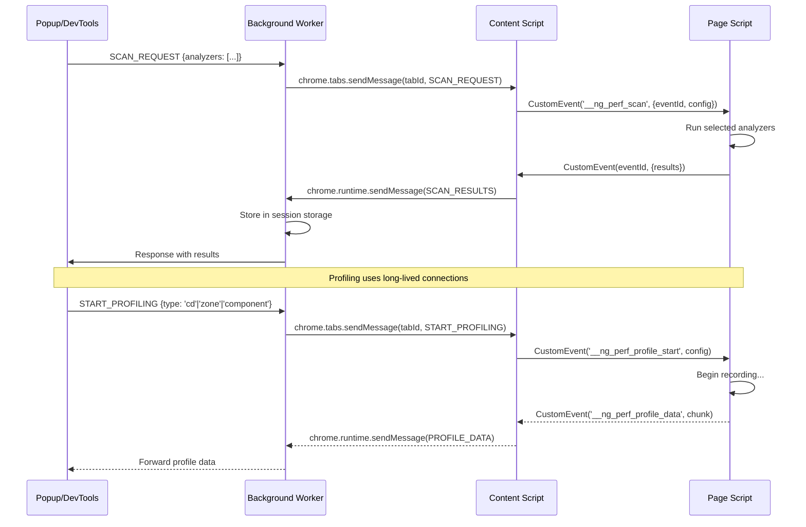

# Design Document: Angular Performance Inspector

## Overview

The Angular Performance Inspector is a Chrome Extension (Manifest V3) that provides comprehensive runtime performance analysis for Angular applications. It extends the existing basic detection and change detection checking into a full-featured performance tool with real-time scoring, production heuristics, DOM/render bottleneck detection, Signals migration suggestions, RxJS leak detection, enterprise optimization recommendations, state viewers, profilers, bundle analysis, and network correlation.

The extension operates across four execution contexts:
1. **Page Script** (main world) — accesses `window.ng`, Angular internals, DOM APIs, and Performance APIs
2. **Content Script** (isolated world) — bridges page context to extension APIs via CustomEvents
3. **Background Service Worker** — manages extension lifecycle, session storage, and cross-context coordination
4. **UI Layer** (Popup + DevTools Panel) — renders dashboards, visualizations, and user controls

The design prioritizes:
- **Non-intrusive analysis**: No modification of the Angular application's runtime behavior
- **Graceful degradation**: Partial analysis in production mode when `window.ng` is unavailable
- **Performance**: Analysis itself must not degrade the inspected application (< 5ms overhead per scan cycle)
- **Modularity**: Each analyzer is an independent module with a shared interface contract

## Architecture

### High-Level Component Diagram

```mermaid
graph TB
    subgraph "Page Context (Main World)"
        PS[Page Script]
        subgraph "Analyzers"
            PerfScorer[Performance Scorer]
            ProdAnalyzer[Production Analyzer]
            DOMInspector[DOM Inspector]
            SignalsAdvisor[Signals Advisor]
            RxJSDetector[RxJS Leak Detector]
            EntOptimizer[Enterprise Optimizer]
            StateViewer[State Viewer]
            CDProfiler[Change Detection Profiler]
            ZoneProfiler[Zone.js Profiler]
            CompProfiler[Component Profiler]
            BundleAnalyzer[Bundle Analyzer]
            NetCorrelator[Network Correlator]
        end
        PS --> PerfScorer
        PS --> ProdAnalyzer
        PS --> DOMInspector
        PS --> SignalsAdvisor
        PS --> RxJSDetector
        PS --> EntOptimizer
        PS --> StateViewer
        PS --> CDProfiler
        PS --> ZoneProfiler
        PS --> CompProfiler
        PS --> BundleAnalyzer
        PS --> NetCorrelator
    end

    subgraph "Content Script (Isolated World)"
        CS[Content Script]
        Overlay[Element Overlay]
    end

    subgraph "Extension Context"
        BG[Background Service Worker]
        subgraph "UI Layer"
            Popup[Popup Dashboard]
            DevTools[DevTools Panel]
        end
        ActionList[Action List Prioritizer]
        ReportExporter[Report Exporter]
        HelpContent[Contextual Help Store]
    end

    PS <-->|CustomEvent| CS
    CS <-->|chrome.runtime.sendMessage| BG
    BG <-->|chrome.runtime.onMessage| Popup
    BG <-->|chrome.runtime.connect (port)| DevTools
    Popup --> ActionList
    Popup --> ReportExporter
    Popup --> HelpContent
    DevTools --> ActionList
    DevTools --> ReportExporter
    DevTools --> HelpContent
    CS --> Overlay
```

### Communication Flow



### Module Boundaries

| Module | Execution Context | Dependencies | Responsibility |
|--------|------------------|--------------|----------------|
| Page Script Core | Main World | Angular APIs, DOM, Performance API | Orchestrates analyzers, manages scan lifecycle |
| Content Script | Isolated World | chrome.runtime, DOM | Message relay, overlay injection |
| Background Worker | Service Worker | chrome.storage.session, chrome.tabs | State persistence, tab management, routing |
| Popup UI | Extension Page | Background Worker API | Quick-glance dashboard |
| DevTools Panel | DevTools Page | Background Worker API | Full persistent dashboard |
| Action List | Extension Context | Analysis results | Prioritization algorithm |
| Report Exporter | Extension Context | Analysis results | Format conversion and export |
| Help Content | Extension Bundle | Static JSON | Contextual documentation |

## Components and Interfaces

### Analyzer Module Interface

Every analyzer implements a common interface to ensure consistent orchestration:

```typescript
// src/types/analyzer.ts

export type Severity = 'critical' | 'high' | 'medium' | 'low' | 'info';
export type RuntimeMode = 'development' | 'production';

export interface AnalyzerConfig {
  maxElements?: number;       // DOM traversal limit (default: 1000)
  timeout?: number;           // Per-analyzer timeout in ms (default: 5000)
  mode: RuntimeMode;
}

export interface AnalysisIssue {
  id: string;                 // Unique issue identifier
  analyzer: AnalyzerType;     // Source analyzer
  component: string;          // Affected component name
  severity: Severity;
  category: IssueCategory;
  title: string;              // Short description
  description: string;        // Detailed explanation
  recommendation: string;     // Fix suggestion
  metadata?: Record<string, unknown>; // Analyzer-specific data
  elementSelector?: string;   // CSS selector for overlay targeting
}

export type AnalyzerType =
  | 'performance-scorer'
  | 'production-analyzer'
  | 'dom-inspector'
  | 'signals-advisor'
  | 'rxjs-leak-detector'
  | 'enterprise-optimizer'
  | 'state-viewer'
  | 'change-detection-profiler'
  | 'zone-profiler'
  | 'component-profiler'
  | 'bundle-analyzer'
  | 'network-correlator';

export type IssueCategory =
  | 'change-detection'
  | 'dom-complexity'
  | 'memory-leaks'
  | 'bundle-size'
  | 'signals-migration'
  | 'zone-triggers'
  | 'network-correlation'
  | 'render-performance'
  | 'state-management';

export interface AnalyzerResult {
  analyzer: AnalyzerType;
  timestamp: number;
  duration: number;           // Time taken to run analysis in ms
  issues: AnalysisIssue[];
  metadata?: Record<string, unknown>;
}

export interface Analyzer {
  readonly type: AnalyzerType;
  readonly requiresDevMode: boolean;
  analyze(config: AnalyzerConfig): Promise<AnalyzerResult>;
  dispose(): void;
}
```

### Performance Score Model

```typescript
// src/types/scoring.ts

export interface PerformanceSubScore {
  name: string;
  score: number;              // 0-100
  weight: number;             // 0-1, all weights sum to 1
  details: string;
}

export interface PerformanceScore {
  overall: number;            // 0-100 weighted sum
  subScores: {
    changeDetection: PerformanceSubScore;   // weight: 0.4
    componentTreeDepth: PerformanceSubScore; // weight: 0.2
    templateComplexity: PerformanceSubScore;  // weight: 0.2
    detectedBottlenecks: PerformanceSubScore; // weight: 0.2
  };
  timestamp: number;
  mode: RuntimeMode;
}
```

### Communication Protocol

```typescript
// src/types/messages.ts

export type MessageType =
  | 'SCAN_REQUEST'
  | 'SCAN_RESULTS'
  | 'START_PROFILING'
  | 'STOP_PROFILING'
  | 'PROFILE_DATA'
  | 'PROFILE_COMPLETE'
  | 'STATE_REQUEST'
  | 'STATE_RESPONSE'
  | 'OVERLAY_SHOW'
  | 'OVERLAY_HIDE'
  | 'DETECTION_STATUS'
  | 'TAB_NAVIGATED'
  | 'ERROR';

export interface ExtensionMessage<T = unknown> {
  type: MessageType;
  payload: T;
  tabId?: number;
  timestamp: number;
}

// Page Script <-> Content Script (CustomEvent-based)
export interface PageMessage<T = unknown> {
  eventId: string;
  type: MessageType;
  payload: T;
}

// Scan request payload
export interface ScanRequestPayload {
  analyzers: AnalyzerType[];  // Which analyzers to run
  config?: Partial<AnalyzerConfig>;
}

// Full scan results
export interface ScanResultsPayload {
  detection: DetectionResult;
  score: PerformanceScore;
  results: AnalyzerResult[];
  actionItems: ActionItem[];
}

export interface DetectionResult {
  isAngular: boolean;
  version: string | null;
  mode: RuntimeMode | null;
  componentCount: number;
}
```

### Profiling Data Models

```typescript
// src/types/profiling.ts

export interface ChangeDetectionCycle {
  id: number;
  timestamp: number;
  duration: number;           // ms
  componentsChecked: number;
  trigger: CDTrigger;
  domMutations: number;
}

export type CDTrigger = 'user-event' | 'timer' | 'http-response' | 'programmatic' | 'unknown';

export interface ZoneTask {
  id: number;
  type: 'macroTask' | 'microTask' | 'eventTask';
  source: string;             // setTimeout, setInterval, addEventListener, Promise, HTTP
  timestamp: number;
  triggeredCD: boolean;
  causedDOMUpdate: boolean;
}

export interface ComponentRenderEntry {
  componentName: string;
  renderTime: number;         // ms
  cycleId: number;            // Reference to CD cycle
  timestamp: number;
}

export interface ProfilingSession {
  id: string;
  startTime: number;
  endTime?: number;
  type: 'change-detection' | 'zone' | 'component';
  cycles: ChangeDetectionCycle[];
  zoneTasks: ZoneTask[];
  renderEntries: ComponentRenderEntry[];
  maxCycles: number;          // 5000 cap
}
```

### Bundle and Network Models

```typescript
// src/types/bundle.ts

export type BundleCategory = 'vendor' | 'polyfills' | 'main' | 'lazy-chunk';

export interface BundleEntry {
  url: string;
  filename: string;
  category: BundleCategory;
  transferSize: number;       // bytes (compressed)
  decodedSize: number;        // bytes (decompressed)
  sizeUnavailable: boolean;   // true if cross-origin restricted
}

export interface BundleAnalysis {
  entries: BundleEntry[];
  totalTransferSize: number;
  totalDecodedSize: number;
  categoryBreakdown: Record<BundleCategory, {
    count: number;
    totalSize: number;
  }>;
  oversizedEntries: BundleEntry[]; // > 250KB decompressed
}
```

```typescript
// src/types/network.ts

export interface NetworkRequest {
  url: string;
  method: string;
  startTime: number;
  responseEnd: number;
  status: number;
  duration: number;
  correlatedCycleId?: number;  // Linked CD cycle
  responseToRenderTime?: number; // ms from response to DOM update
  isSlowRender: boolean;       // > 100ms response-to-render
}

export interface NetworkCorrelation {
  request: NetworkRequest;
  cdCycle?: ChangeDetectionCycle;
  domUpdateTime?: number;
}
```

### Action Item and Report Models

```typescript
// src/types/actions.ts

export type ImpactLevel = 'high' | 'medium' | 'low';

export interface ActionItem {
  id: string;
  rank: number;
  issue: AnalysisIssue;
  impactLevel: ImpactLevel;
  estimatedGain: string;      // Human-readable gain description
  resolved: boolean;          // Compared against previous scan
}

export interface ActionListState {
  items: ActionItem[];
  filters: {
    severity: Severity[];
    category: IssueCategory[];
  };
  maxDisplay: number;         // 50
  previousScanItems?: ActionItem[];
}
```

```typescript
// src/types/report.ts

export interface ReportData {
  timestamp: string;          // ISO 8601
  angularVersion: string | null;
  pageUrl: string;
  componentCount: number;
  score: PerformanceScore;
  issues: AnalysisIssue[];
  actionItems: ActionItem[];
}

export type ExportFormat = 'json' | 'markdown' | 'clipboard';
```

### State Viewer Model

```typescript
// src/types/state.ts

export interface ComponentState {
  componentName: string;
  elementSelector: string;
  properties: StateProperty[];
  lastUpdated: number;
}

export interface StateProperty {
  name: string;
  value: string;              // JSON-serialized, truncated at 500 chars
  type: string;               // typeof result
  isCircular: boolean;
  isTruncated: boolean;
  changed: boolean;           // Changed since last poll
}

export interface StoreState {
  storeType: 'ngrx' | 'ngxs' | 'akita' | null;
  state: Record<string, unknown>;
  maxDepth: number;           // 5
}
```

### Contextual Help Model

```typescript
// src/types/help.ts

export interface HelpEntry {
  issueCategory: IssueCategory;
  issueType: string;          // Specific issue identifier
  whyItMatters: string;       // 1-3 sentences
  howToFix: string[];         // Step-by-step, max 5 steps
  codeExample?: {
    before: string;           // Max 15 lines
    after: string;            // Max 15 lines
  };
  expectedImprovement: 'latency-reduction' | 'memory-reduction' | 'render-efficiency';
  documentationUrl: string;   // angular.dev link
}
```

### Overlay Model

```typescript
// src/types/overlay.ts

export interface OverlayConfig {
  elementSelector: string;
  severity: Severity;
  componentName: string;
  issueType: string;
  autoFadeTimeout: number;    // 5000ms
  zIndex: number;             // 2147483647
}
```

## Data Models

### Session Storage Schema

The background worker persists scan state per tab using `chrome.storage.session`:

```typescript
// Storage key pattern: `tab_{tabId}_state`
export interface TabSessionState {
  tabId: number;
  lastScanResults: ScanResultsPayload | null;
  previousScanResults: ScanResultsPayload | null; // For resolved comparison
  detection: DetectionResult | null;
  activeProfilingSession: ProfilingSession | null;
  lastUpdated: number;
}
```

### Data Flow Summary

```mermaid
flowchart LR
    subgraph "Collection (Page Script)"
        A[Angular APIs] --> B[Raw Metrics]
        C[DOM APIs] --> B
        D[Performance API] --> B
    end

    subgraph "Processing (Page Script)"
        B --> E[Analyzer Modules]
        E --> F[AnalyzerResult[]]
    end

    subgraph "Transport"
        F -->|CustomEvent| G[Content Script]
        G -->|chrome.runtime| H[Background Worker]
    end

    subgraph "Presentation"
        H -->|session storage| I[Tab State]
        I --> J[Popup UI]
        I --> K[DevTools Panel]
        J --> L[Action List]
        J --> M[Visualizations]
        K --> L
        K --> M
    end
```

### Expanded File/Folder Structure

```
src/
├── background/
│   ├── background.ts              # Service worker entry
│   ├── tab-manager.ts             # Tab state lifecycle
│   └── message-router.ts          # Message routing logic
├── content/
│   ├── content.ts                 # Content script entry
│   ├── page-script.ts             # Page context entry (orchestrator)
│   ├── overlay.ts                 # Element highlighting overlay
│   └── message-bridge.ts          # CustomEvent <-> chrome.runtime bridge
├── analyzers/
│   ├── index.ts                   # Analyzer registry and orchestrator
│   ├── base-analyzer.ts           # Abstract base class
│   ├── performance-scorer.ts      # Weighted score computation
│   ├── production-analyzer.ts     # DOM-based heuristics
│   ├── dom-inspector.ts           # Layout thrashing, DOM complexity
│   ├── signals-advisor.ts         # Signals migration suggestions
│   ├── rxjs-leak-detector.ts      # Subscription leak detection
│   ├── enterprise-optimizer.ts    # Large-scale app recommendations
│   ├── state-viewer.ts            # Component/store state inspection
│   ├── change-detection-profiler.ts
│   ├── zone-profiler.ts           # Zone.js task interception
│   ├── component-profiler.ts      # Render time measurement
│   ├── bundle-analyzer.ts         # Resource timing analysis
│   └── network-correlator.ts      # Request-render correlation
├── ui/
│   ├── popup/
│   │   ├── popup.ts               # Popup entry point
│   │   ├── popup.css              # Popup styles
│   │   ├── components/
│   │   │   ├── score-display.ts   # Performance score widget
│   │   │   ├── tab-navigation.ts  # Tab switching logic
│   │   │   ├── action-list.ts     # Prioritized action items
│   │   │   ├── issue-card.ts      # Individual issue display
│   │   │   ├── timeline-chart.ts  # CD cycle timeline
│   │   │   ├── flame-chart.ts     # Component render flame chart
│   │   │   ├── bundle-chart.ts    # Bundle size bar chart
│   │   │   ├── waterfall.ts       # Network waterfall view
│   │   │   ├── state-tree.ts      # State viewer tree
│   │   │   └── help-panel.ts      # Contextual help display
│   │   └── utils/
│   │       ├── render.ts          # DOM rendering helpers
│   │       └── theme.ts           # Dark/light mode
│   └── devtools/
│       ├── devtools.ts            # DevTools page (registers panel)
│       ├── panel.html             # Panel HTML entry
│       └── panel.ts               # Panel script (shares UI components)
├── services/
│   ├── action-prioritizer.ts      # Impact scoring algorithm
│   ├── report-exporter.ts         # JSON/Markdown/clipboard export
│   └── help-content.ts            # Help data access layer
├── data/
│   └── help-entries.json          # Static contextual help content
├── types/
│   ├── analyzer.ts
│   ├── scoring.ts
│   ├── messages.ts
│   ├── profiling.ts
│   ├── bundle.ts
│   ├── network.ts
│   ├── actions.ts
│   ├── report.ts
│   ├── state.ts
│   ├── help.ts
│   └── overlay.ts
└── utils/
    ├── dom-utils.ts               # DOM traversal helpers
    ├── serializer.ts              # Safe JSON serialization
    ├── timing.ts                  # Performance measurement utilities
    └── constants.ts               # Shared constants and thresholds
```

### Vite Build Configuration (Updated)

The build must produce separate bundles for each execution context:

| Entry | Output | Context |
|-------|--------|---------|
| `src/content/page-script.ts` | `page-script.js` | Main world (web_accessible_resources) |
| `src/content/content.ts` | `content.js` | Isolated world (content_scripts) |
| `src/background/background.ts` | `background.js` | Service worker |
| `popup.html` | `popup.html` + `popup.js` | Extension popup |
| `src/ui/devtools/devtools.ts` | `devtools.js` | DevTools page |
| `src/ui/devtools/panel.html` | `panel.html` + `panel.js` | DevTools panel |

The analyzers are bundled into `page-script.js` since they execute in the page's main world context. The UI components, services, and help data are bundled into the popup and panel outputs.

### Manifest V3 Updates

```json
{
  "devtools_page": "devtools.html",
  "permissions": ["activeTab", "scripting", "tabs", "storage"]
}
```

## Correctness Properties

*A property is a characteristic or behavior that should hold true across all valid executions of a system — essentially, a formal statement about what the system should do. Properties serve as the bridge between human-readable specifications and machine-verifiable correctness guarantees.*

### Property 1: Angular Detection Correctness

*For any* page state defined by the presence/absence of `window.ng` and the presence/absence of Angular DOM markers (`[ng-version]`, `[_nghost]`), the detection function SHALL correctly report: mode "development" when `window.ng` is present, mode "production" when only markers are present, and `isAngular: false` when neither is present.

**Validates: Requirements 1.2, 1.3, 1.4**

### Property 2: Performance Score Computation and Range

*For any* four sub-scores each in the range [0, 100], the Performance Scorer SHALL compute the overall score as `0.4 * changeDetection + 0.2 * componentTreeDepth + 0.2 * templateComplexity + 0.2 * detectedBottlenecks`, and the result SHALL always be a number in the range [0, 100].

**Validates: Requirements 2.1, 2.2**

### Property 3: Score Color Mapping

*For any* performance score in [0, 100], the color indicator SHALL be "green" if score >= 80, "yellow" if score >= 50 and < 80, and "red" if score < 50.

**Validates: Requirements 2.4**

### Property 4: Production Component Boundary Inference

*For any* DOM tree containing elements with `_nghost-*` attributes, the Production Analyzer SHALL identify each such element as a component boundary and derive the component name from the element's tag name.

**Validates: Requirements 3.1**

### Property 5: Component Tree Depth Calculation

*For any* DOM tree with nested Angular host elements, the Production Analyzer SHALL correctly calculate the nesting depth and the result SHALL never exceed 512.

**Validates: Requirements 3.2**

### Property 6: DOM Complexity Threshold Detection

*For any* component subtree with a measurable DOM node count, the analyzer SHALL flag the component as having excessive complexity if and only if the node count exceeds the configured threshold (1500 for production analyzer, 800 for DOM inspector).

**Validates: Requirements 3.3, 4.2**

### Property 7: Layout Thrashing Detection

*For any* sequence of DOM operations within a synchronous frame, the DOM Inspector SHALL detect layout thrashing if and only if there are 3 or more alternating read-write operations in the sequence.

**Validates: Requirements 4.1**

### Property 8: Mutation-Based Bottleneck Detection

*For any* change detection cycle with a recorded DOM mutation count, the DOM Inspector SHALL flag the cycle as a render bottleneck if and only if the mutation count exceeds 50.

**Validates: Requirements 4.4**

### Property 9: Render Duration Threshold

*For any* measured rendering phase duration, the DOM Inspector SHALL flag it as a render bottleneck if and only if the duration exceeds 16 milliseconds.

**Validates: Requirements 4.5**

### Property 10: Signals Suggestion Ordering and Cap

*For any* set of migration suggestions produced by the Signals Advisor, the output SHALL be ordered by migration effort from low to high, and the total count SHALL not exceed 20.

**Validates: Requirements 5.8**

### Property 11: RxJS Cleanup Pattern Recognition

*For any* component subscription that has a valid cleanup pattern (unsubscribe in ngOnDestroy, takeUntil operator, takeUntilDestroyed operator, or async pipe usage), the RxJS Leak Detector SHALL NOT flag it as a potential leak.

**Validates: Requirements 6.2**

### Property 12: Scan Limits Invariant

*For any* RxJS leak detection run, the scanner SHALL process at most 1000 DOM elements and the results SHALL contain at most 50 leak issues.

**Validates: Requirements 6.7**

### Property 13: State Serialization Safety

*For any* component state value, the State Viewer serializer SHALL produce valid JSON output, truncating string values longer than 500 characters with an expand indicator, and replacing circular references with the string "[Circular Reference]" without throwing an exception.

**Validates: Requirements 8.4, 8.5**

### Property 14: Profiling Cycle Cap

*For any* change detection profiling session, the number of recorded cycles SHALL never exceed 5000, and recording SHALL stop automatically when this limit is reached.

**Validates: Requirements 9.1**

### Property 15: Bundle Resource Categorization

*For any* JavaScript resource filename, the Bundle Analyzer SHALL categorize it as "vendor" if the filename contains "vendor" or "node_modules", "polyfills" if it contains "polyfill", "main" if it contains "main", and "lazy-chunk" otherwise.

**Validates: Requirements 12.5**

### Property 16: Bundle Size Threshold

*For any* JavaScript resource with a decompressed size exceeding 250KB (256,000 bytes), the Bundle Analyzer SHALL flag it as oversized.

**Validates: Requirements 12.4**

### Property 17: Cross-Origin Resource Exclusion

*For any* JavaScript resource reporting a `transferSize` of 0, the Bundle Analyzer SHALL mark it as "unavailable" and exclude it from all size-based aggregate calculations.

**Validates: Requirements 12.3**

### Property 18: Network-Render Correlation Timing

*For any* pair of (HTTP response end timestamp, change detection cycle start timestamp), the Network Correlator SHALL link them as correlated if and only if the time difference is 200 milliseconds or less.

**Validates: Requirements 13.2**

### Property 19: Slow Render Response Detection

*For any* correlated network request where the time between HTTP response receipt and DOM update completion exceeds 100 milliseconds, the Network Correlator SHALL flag it as a slow render response.

**Validates: Requirements 13.5**

### Property 20: Action List Impact Sorting

*For any* set of detected issues, the Action List SHALL produce a ranked list where each item's estimated impact is greater than or equal to the next item's estimated impact (sorted descending).

**Validates: Requirements 16.1**

### Property 21: Action List Filtering

*For any* set of action items and any applied filter (severity levels or issue categories), the filtered output SHALL contain only items whose severity or category matches the filter criteria, and no matching items SHALL be excluded.

**Validates: Requirements 16.4, 16.5**

### Property 22: Action List Display Cap

*For any* scan producing action items, the displayed list SHALL contain at most 50 items.

**Validates: Requirements 16.6**

### Property 23: Resolved Issue Detection

*For any* two consecutive scan results (previous and current), an action item SHALL be marked as "resolved" if and only if it was present in the previous scan results but absent from the current scan results, compared by issue id.

**Validates: Requirements 16.8**

### Property 24: Report Data Sanitization

*For any* scan results containing DOM references, function objects, or circular structures, the Report Exporter SHALL produce output containing only serializable primitive values, arrays, and plain objects — no functions, DOM nodes, or circular references SHALL appear in the exported data.

**Validates: Requirements 18.6**

### Property 25: Report Metadata Completeness

*For any* exported report in any format (JSON, Markdown, clipboard), the output SHALL include the scan timestamp in ISO 8601 format, the detected Angular version, the page URL, and the total number of components analyzed.

**Validates: Requirements 18.4**

### Property 26: Help Content Completeness

*For any* issue category defined in the system (change-detection, dom-complexity, memory-leaks, bundle-size, signals-migration, zone-triggers, network-correlation), there SHALL exist at least one help entry in the contextual help store.

**Validates: Requirements 20.4**

### Property 27: Overlay Severity Color Mapping

*For any* issue severity, the Element Overlay SHALL apply the correct background color: red for "critical", orange for "warning"/"high"/"medium", and blue for "info"/"low".

**Validates: Requirements 17.2**

## Error Handling

### Error Categories and Strategies

| Error Type | Source | Strategy | User Impact |
|-----------|--------|----------|-------------|
| Page script injection failure | Content Script | Report error to popup, disable analysis | "Page access restricted" message |
| `window.ng` unavailable | Page Script | Fall back to production analyzer | Partial results with degradation notice |
| Analyzer timeout (>5s) | Page Script | Abort analyzer, return partial results | Timeout indicator per analyzer |
| Circular reference in state | State Viewer | Replace with "[Circular Reference]" | Graceful display |
| Cross-origin resource restriction | Bundle Analyzer | Mark as "unavailable", exclude from totals | Size shown as "N/A" |
| Component destroyed during scan | State Viewer | Clear state, show "no longer available" | Informational message |
| Profiling overflow (5000 cycles) | CD Profiler | Auto-stop, retain collected data | "Limit reached" notification |
| Session storage quota exceeded | Background Worker | Evict oldest tab data, warn user | Stale data cleared |
| DevTools panel disconnection | Background Worker | Reconnect on next message, buffer data | Brief data gap |

### Error Propagation

```typescript
// All analyzers wrap errors in a standard envelope
export interface AnalyzerError {
  analyzer: AnalyzerType;
  code: string;
  message: string;
  recoverable: boolean;
  fallbackResult?: Partial<AnalyzerResult>;
}
```

Errors are non-fatal by default. Each analyzer catches its own exceptions and returns a result with an empty issues array plus an error field. The orchestrator collects all results regardless of individual analyzer failures, ensuring partial analysis is always available.

### Timeout Strategy

- Per-analyzer timeout: 5 seconds (configurable)
- Full scan timeout: 15 seconds (sum of all analyzers with parallelism)
- Profiling auto-stop: 300 seconds (Zone Profiler)
- MutationObserver disconnect: 100ms after scan completes
- Page script response timeout: 3 seconds (existing behavior preserved)

## Testing Strategy

### Dual Testing Approach

The project uses a dual testing strategy combining property-based tests for universal invariants and example-based unit tests for specific scenarios.

**Property-Based Testing Library**: [fast-check](https://github.com/dubzzz/fast-check) (TypeScript-native, integrates with Vitest)

**Test Runner**: Vitest (aligns with existing Vite build tooling)

### Property-Based Tests

Each correctness property (Properties 1-27) is implemented as a property-based test with:
- Minimum **100 iterations** per property
- Tag format: `Feature: angular-performance-inspector, Property {N}: {title}`
- Custom arbitraries for Angular-specific data structures (component metadata, DOM trees, resource timing entries)

**Key Arbitraries to Implement:**
- `arbAngularPageState` — generates combinations of window.ng presence and DOM markers
- `arbSubScores` — generates four numbers in [0, 100]
- `arbDOMTree` — generates mock DOM structures with Angular attributes
- `arbResourceTimingEntry` — generates PerformanceResourceTiming-like objects
- `arbAnalysisIssue` — generates random issues with valid severity/category
- `arbComponentState` — generates objects with various types including circular refs

### Unit Tests (Example-Based)

| Module | Focus Areas |
|--------|-------------|
| Detection | Specific Angular version strings, edge cases (empty DOM, multiple apps) |
| Performance Scorer | Known score calculations, boundary values (0, 50, 79, 80, 100) |
| Production Analyzer | Real-world DOM snapshots, minified attribute patterns |
| Signals Advisor | Specific BehaviorSubject patterns, Input/Output detection |
| RxJS Leak Detector | Known leak patterns, valid cleanup patterns |
| State Viewer | Nested objects, arrays, dates, regex, undefined values |
| Bundle Analyzer | Real resource timing data, mixed cross-origin scenarios |
| Action Prioritizer | Known issue sets with expected rankings |
| Report Exporter | Format validation (valid JSON, valid Markdown) |
| Message Bridge | Message serialization round-trips |

### Integration Tests

| Scope | What's Tested |
|-------|---------------|
| Content ↔ Page Script | CustomEvent dispatch and response |
| Content ↔ Background | chrome.runtime message passing |
| Background ↔ Popup | Session storage persistence and retrieval |
| Full scan pipeline | End-to-end from scan button to results display |
| DevTools sync | Simultaneous popup + panel updates |
| Overlay lifecycle | Show, auto-fade, dismiss, scroll-into-view |

### Test File Structure

```
tests/
├── properties/
│   ├── detection.property.test.ts
│   ├── scoring.property.test.ts
│   ├── dom-thresholds.property.test.ts
│   ├── bundle-categorization.property.test.ts
│   ├── network-correlation.property.test.ts
│   ├── action-list.property.test.ts
│   ├── serialization.property.test.ts
│   ├── report-export.property.test.ts
│   └── help-completeness.property.test.ts
├── unit/
│   ├── analyzers/
│   │   ├── performance-scorer.test.ts
│   │   ├── production-analyzer.test.ts
│   │   ├── dom-inspector.test.ts
│   │   ├── signals-advisor.test.ts
│   │   ├── rxjs-leak-detector.test.ts
│   │   ├── enterprise-optimizer.test.ts
│   │   ├── state-viewer.test.ts
│   │   ├── bundle-analyzer.test.ts
│   │   └── network-correlator.test.ts
│   ├── services/
│   │   ├── action-prioritizer.test.ts
│   │   ├── report-exporter.test.ts
│   │   └── help-content.test.ts
│   └── utils/
│       ├── serializer.test.ts
│       └── dom-utils.test.ts
├── integration/
│   ├── message-flow.test.ts
│   ├── scan-pipeline.test.ts
│   └── overlay.test.ts
└── arbitraries/
    ├── angular-page.arb.ts
    ├── dom-tree.arb.ts
    ├── resource-timing.arb.ts
    ├── analysis-issue.arb.ts
    └── component-state.arb.ts
```

### Module Design Details

#### Performance Scorer Algorithm

```typescript
function computeScore(metrics: ScanMetrics): PerformanceScore {
  const cdScore = computeCDScore(metrics.onPushRatio, metrics.totalComponents);
  const depthScore = computeDepthScore(metrics.maxTreeDepth);
  const templateScore = computeTemplateScore(metrics.avgDeclarations);
  const bottleneckScore = computeBottleneckScore(metrics.issueCount, metrics.criticalCount);

  const overall = Math.round(
    cdScore.score * 0.4 +
    depthScore.score * 0.2 +
    templateScore.score * 0.2 +
    bottleneckScore.score * 0.2
  );

  return { overall: Math.max(0, Math.min(100, overall)), subScores: { ... } };
}
```

#### Action List Prioritization Algorithm

The prioritization uses a composite score based on:
1. **Severity weight**: critical=100, high=75, medium=50, low=25, info=10
2. **Category multiplier**: change-detection=1.5, memory-leaks=1.4, render-performance=1.3, dom-complexity=1.2, bundle-size=1.1, others=1.0
3. **Frequency bonus**: +10 per additional occurrence of the same issue type

```typescript
function computeImpactScore(issue: AnalysisIssue, occurrences: number): number {
  const severityWeight = SEVERITY_WEIGHTS[issue.severity];
  const categoryMultiplier = CATEGORY_MULTIPLIERS[issue.category];
  const frequencyBonus = Math.min((occurrences - 1) * 10, 50);
  return severityWeight * categoryMultiplier + frequencyBonus;
}
```

Items are sorted by impact score descending, then mapped to impact levels:
- Score >= 100: "high"
- Score >= 50: "medium"
- Score < 50: "low"

#### Element Overlay Injection

The overlay is injected by the Content Script (isolated world) since it needs to manipulate the page DOM without accessing Angular internals:

```typescript
// content/overlay.ts
function showOverlay(config: OverlayConfig): void {
  const target = document.querySelector(config.elementSelector);
  if (!target) { notifyElementMissing(); return; }

  // Scroll into view if needed
  if (!isInViewport(target)) {
    target.scrollIntoView({ behavior: 'smooth', block: 'center' });
  }

  const rect = target.getBoundingClientRect();
  const overlay = createOverlayElement(rect, config);
  document.body.appendChild(overlay);

  // Auto-fade after 5s
  setTimeout(() => fadeAndRemove(overlay), config.autoFadeTimeout);

  // Dismiss on click outside or Escape
  setupDismissListeners(overlay);
}
```

#### Report Exporter Approach

```typescript
// services/report-exporter.ts
function exportAsJSON(data: ReportData): void {
  const sanitized = sanitize(data);
  const blob = new Blob([JSON.stringify(sanitized, null, 2)], { type: 'application/json' });
  downloadBlob(blob, `angular-perf-report-${Date.now()}.json`);
}

function exportAsMarkdown(data: ReportData): void {
  const sanitized = sanitize(data);
  const md = generateMarkdownReport(sanitized);
  const blob = new Blob([md], { type: 'text/markdown' });
  downloadBlob(blob, `angular-perf-report-${Date.now()}.md`);
}

function copyToClipboard(data: ReportData): void {
  const summary = generatePlainTextSummary(data);
  navigator.clipboard.writeText(summary);
}

function sanitize(data: unknown): unknown {
  // Removes functions, DOM refs, circular structures
  // Uses a custom replacer with WeakSet for cycle detection
}
```

#### Contextual Help Content Storage

Help content is stored as a static JSON file bundled with the extension:

```typescript
// data/help-entries.json structure
{
  "change-detection": {
    "default-strategy": {
      "whyItMatters": "Components using Default change detection...",
      "howToFix": ["Add ChangeDetectionStrategy.OnPush...", ...],
      "codeExample": { "before": "...", "after": "..." },
      "expectedImprovement": "render-efficiency",
      "documentationUrl": "https://angular.dev/guide/change-detection"
    }
  },
  "dom-complexity": { ... },
  "memory-leaks": { ... },
  "bundle-size": { ... },
  "signals-migration": { ... },
  "zone-triggers": { ... },
  "network-correlation": { ... }
}
```

This ensures requirement 20.7 (no network requests for help content) is satisfied.

